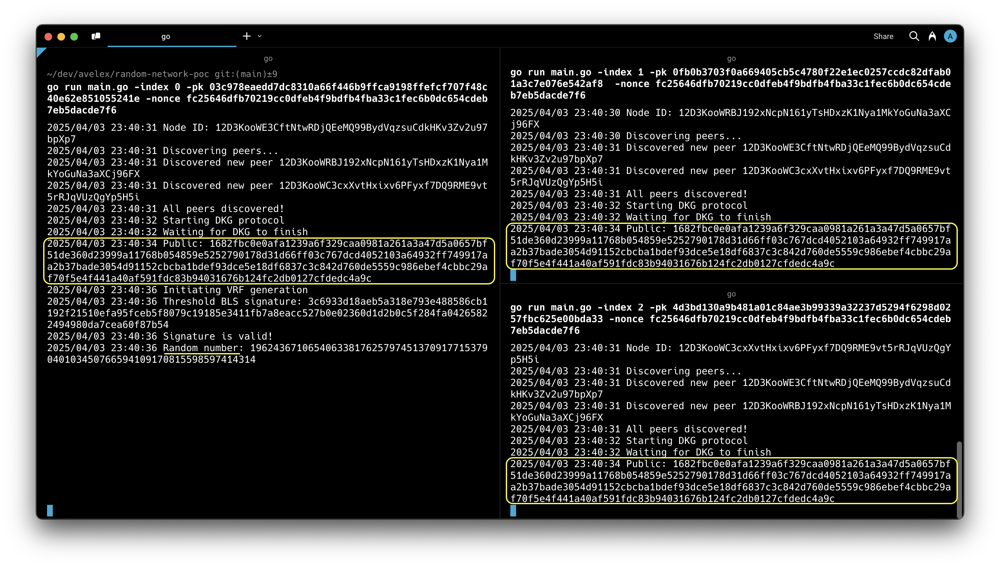

# Random Native Network

This blockchain component demonstrates a robust Distributed Key Generation (DKG) protocol with Verifiable Random Function (VRF) capabilities, leveraging BLS threshold signatures for secure randomness generation. This system enables blockchain validators to collectively produce unpredictable, unbiasable, and verifiable random numbers critical for consensus algorithms, validator selection, and fair execution of on-chain applications.

## Demo



## Blockchain Architecture Components

### Core Functionality

1. **Distributed Key Generation (DKG)**
   - Utilizes Pedersen DKG protocol for secure distributed key generation
   - Implements threshold cryptography (t-of-n) for Byzantine fault tolerance
   - Preserves security even when up to t-1 validators are compromised

2. **Verifiable Random Function (VRF)**
   - Leverages BLS threshold signatures to generate verifiable randomness
   - Ensures unpredictability and non-manipulability properties
   - Provides on-chain verifiability of generated random values
   - Protects against validator collusion and randomness manipulation

3. **Consensus Integration**
   - Produces deterministic randomness from block data
   - Support for secure validator selection and committee formation
   - Enables fair execution of random-dependent protocols

## System Requirements

- Go 1.24 or higher
- Network connectivity between validator nodes
- Secure key management for private key shares

## Validator Node Setup

The system requires at least 3 validator nodes with a 2-of-3 threshold configuration. Each validator needs:
- A unique index (0, 1, or 2)
- Securely generated private key
- Synchronized nonce value across all validators
- Dedicated network port for P2P communication

### Validator Key Configuration

Validator private keys and the shared nonce are defined in the `nodes` file:

| Validator | Private Key | Port |
|-----------|-------------|------|
| Node 0 | `6b865eeebef3a3ad47a6bb43d9c7f6a8b7bd3dca5f508a9842fb8c4f549ef2d1` | 8000 |
| Node 1 | `8c0c2e94d80a74e8875a5d1048cc308a4fdc2bd737bf0c9383d4d786b1b35be3` | 8001 |
| Node 2 | `4d3bd130a9b481a01c84ae3b99339a32237d5294f6298d0257fbc625e00bda33` | 8002 |

**Shared Network Nonce:** `fc25646dfb70219cc0dfeb4f9bdfb4fba33c1fec6b0dc654cdeb7eb5dacde7f6`

### Validator Node Deployment

Deploy validator nodes with their respective configurations:

**Validator 0** (Primary coordinator):
```bash
go run main.go -index 0 -pk 6b865eeebef3a3ad47a6bb43d9c7f6a8b7bd3dca5f508a9842fb8c4f549ef2d1 -nonce fc25646dfb70219cc0dfeb4f9bdfb4fba33c1fec6b0dc654cdeb7eb5dacde7f6 -http_port 8000
```

**Validator 1**:
```bash
go run main.go -index 1 -pk 8c0c2e94d80a74e8875a5d1048cc308a4fdc2bd737bf0c9383d4d786b1b35be3 -nonce fc25646dfb70219cc0dfeb4f9bdfb4fba33c1fec6b0dc654cdeb7eb5dacde7f6 -http_port 8001
```

**Validator 2**:
```bash
go run main.go -index 2 -pk 4d3bd130a9b481a01c84ae3b99339a32237d5294f6298d0257fbc625e00bda33 -nonce fc25646dfb70219cc0dfeb4f9bdfb4fba33c1fec6b0dc654cdeb7eb5dacde7f6 -http_port 8002
```

## Protocol Flow

### Phase 1: Distributed Key Generation

1. Network initialization and validator health verification
2. Secure generation and distribution of key shares (deal bundles)
3. Validation of received deals by each validator
4. Transmission of response bundles acknowledging valid deals
5. Verification of response correctness and threshold satisfaction
6. Finalization of the distributed public key and private shares

### Phase 2: Random Beacon Generation

1. Primary validator (index 0) initiates random beacon round
2. Input seed derived from blockchain state (previous block hash, height, etc.)
3. Each validator produces partial BLS signature on the seed
4. Signatures are collected and verified by the network
5. Threshold signatures are aggregated into a single BLS signature
6. Deterministic hash function applied to produce the final random value
7. Randomness and proof published for on-chain verification

## API Endpoints

The validator nodes expose the following HTTP endpoints:

- `/health` - Validator liveness check
- `/deals` - DKG deal bundle exchange
- `/responses` - DKG response bundle processing
- `/sign_vrf` - VRF signature generation endpoint

## Advanced Cryptographic Properties

This implementation provides the following security properties:

1. **Unpredictability:** No validator can predict the random output before the protocol execution.
2. **Unbiasability:** Validators cannot manipulate the output to their advantage.
3. **Verifiability:** The correctness of the random value can be verified by any observer.
4. **Byzantine Fault Tolerance:** The system tolerates up to t-1 malicious validators.
5. **Forward Secrecy:** Past random values remain secure even if keys are later compromised.

## Security Considerations

While this implementation demonstrates the core concept, production deployments should implement additional security measures:

- TLS encryption for all validator communication
- Rate limiting and DoS protection for public endpoints
- Secure validator key management (HSM recommended)
- Advanced validator authentication mechanisms
- Comprehensive monitoring and alerting system

## License

This project is licensed under the Apache License 2.0. 

This software uses the [Kyber](https://github.com/dedis/kyber) cryptographic library which is licensed under the Mozilla Public License 2.0.
